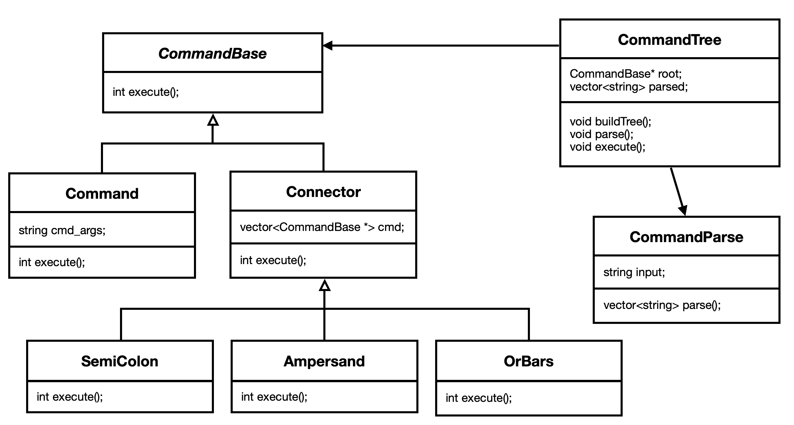

# CS 100 Programming Project

> Authors: Dylan McDowell ([@DylanMcDowell](https://github.com/DylanMcDowell)) and Julien Martin-Prin ([@Flexiboy](https://github.com/Flexiboy))

#Introduction

This project is about to create a shell. The shell should be able to understand what the user want to do. The user should be able to use the bash commands available in the **"/bin/bash"** folder. The shell should also be able to interpret multiple commands inputs with differents connectors such as semi-colon (;), and (&&) and or (||). 
These connector have different functions. For example, the command after the and connector should execute only when the previous command succeed and the command after the or connector should execute only if the previous command failed.

To proceed, we will use a parse tree by associating a priority to each connector, depending on their function. For example, the semi-colon connector has a lower priorty than the or connector. So we will use a parsing fucntion that separates each command and then we will build a tree by using the connectors and their priority. Then, after getting the parse tree, we will execute command and then return their value (succed or not, executed or not) so that we can execute the next function depending on this result.

#OMT diagram

